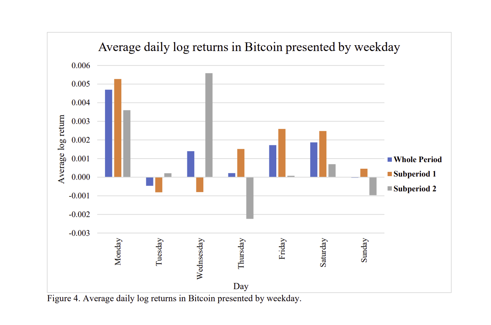

# Python 3.8 Umgebung benutzen
# 1. Modell auswählen (OBV wegmachen, combos randomisieren) 
# 2. features festellen
# 3. string machen und reinpasten
# zip machen...

Fragen:
----------
- Im Dokument steht Transaktionskosten sind gleich 0.005% (5Basispunkte).  
  Aber 0.05% = 0.00005 != 0.0005 = 5 Basispunkte -> NACHFRAGEN
  - Es sind 5 Basispunkte = 0.05%

- Wie sehen die Daten aus, welche in die bot-Funktion kommen? Sind sie EUR/BTC (steht im Dokument, ist aber eine winzige Zahl) oder doch BTC/EUR? 
  - Daten sind BTC/EUR, aber wir sollten warhscheinlich eh nur Binance-Daten nehmen

- Gibt es eine Begrenzung bzgl. Laufzeit? Frage wegen API-Call
  - Lambda Funktion max. 10 minuten 
  - try except für binance mit sleep, wenn down time 

- Nach meinem Verständnis handeln wir von CLOSE zu CLOSE. Wann genau wird die bot-Funktion ausgeführt? Kurz vor oder kurz nach dem Close der Stundenkerze?  
  Z.B. um 10:01 oder um 09:59? Können uns evtl. kurzfristige Informationsvorteile verschaffen. Bzw. ist relevant für die Backtest-Analyse.
  - Binance last price wird genommen. WEnn der Algo 10 minuten läuft, bekommt man den Preis 10 Minuten später. 
    Wir Können vllt den Bid-Ask ausnutzen, wenn sich last price nicht bewegt, Bid-Ask aber schon, können wir trotzdem zum last price handeln mit Vorteil! 

- Ziel ist eine gute Sharpe-Ratio: wird die berechnet in EURO? D.h. wenn man die ganze zeit in EURO bleibt (nicht erlaubt) hätte man eine Varianz von 0?  
  Wenn ja, dann sollten wir uns auf wenige qualitativ hochwertige Signale konzentrieren -> Qualität über Quantität. Müssen keineen hohen Gewinn erzielen, aber niedrige Vola. 
  - Ist tatsächlich so... qualität über quantität!
  - Zu beachten ist, dass wohl die Rendite nicht annualisiert wird, die vola aber schon, insofern ist die Vola noch wichtiger als eh schon

- Wird die die Sharpe-Ratio mit einem bestimmten Referenzzinssatz bestimmt?
  - Nein -> 0%

Paper/ Recherche/ Trading-Ideen:
---------------------------------

- aus https://lutpub.lut.fi/bitstream/handle/10024/166377/Gradu_Seppala_Ville.pdf?sequence=1&isAllowed=y

- https://eichhorn-coaching.de/hexensabbat-an-der-boerse/

- https://edition.cnn.com/markets/fear-and-greed
- https://quantpedia.com/are-there-seasonal-intraday-or-overnight-anomalies-in-bitcoin/
- SMA 200
- Momentum
- Asi-Filter
- Last hour positive or negative

Datenanbieter/ APIS:
-----------------------
Binance:
  - library python-binance
  - um Kurse abzurufen werden keine Keys benötigt
  - Beispiel in Retrieve_BitcoinData.ipynb
  - KLINE_INTERVAL_3MINUTE verfügbar

Geckocoin:
  - https://www.coingecko.com/en/api/pricing
  - Demo account ist kostenlos ("Attribution required" -> was bedeutet das? )
  - Coin Historical Data (5 Minutely) für den letzten Tag stehen zur Verfügung
